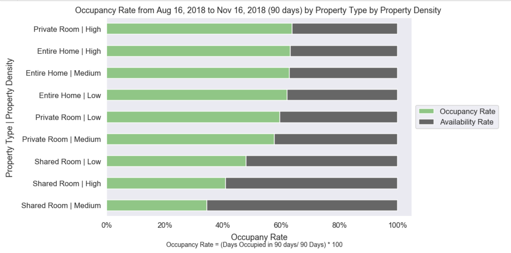
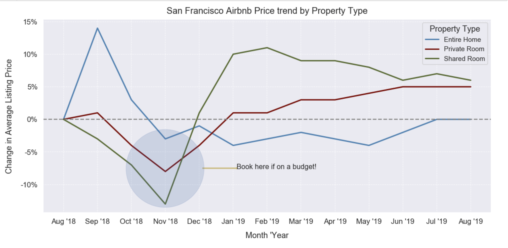
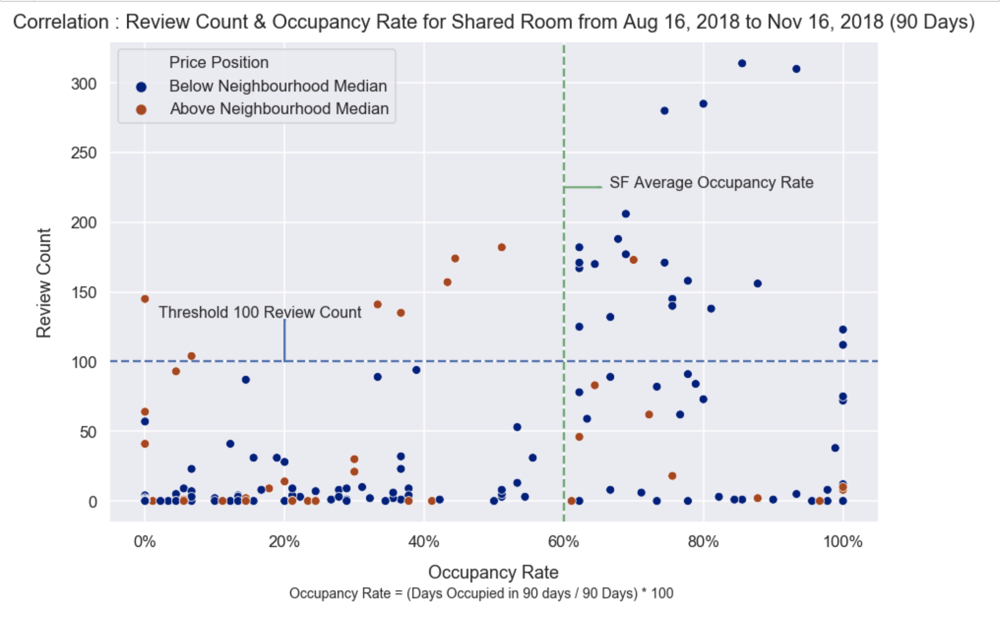
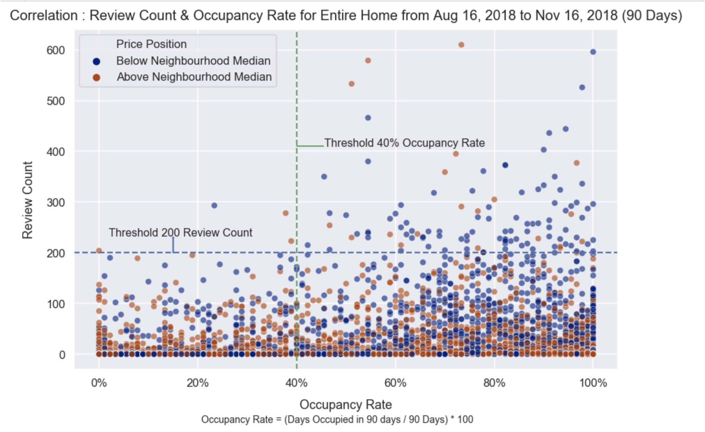

# Airbnb_Data_Viz

#### Authors: Aashka Aradhya and Rico Rey Holganza

Airbnb is a company based in San Francisco that operates an online marketplace and hospitality service for people to lease or rent short-term lodging. I love travelling and have used Airbnb whenever I have the option to and would love to work for them. That's why I decided to analyze data scraped from their website to present interesting insights and visualizations.

#### **This project has used San Francisco Airbnb data scraped from their website on Aug 16th 2018. I used the following datasets available on the link  :** http://insideairbnb.com/get-the-data.html

* **listings_summary.csv:** Detailed information about each listing such as description, host name, geo-coordinates and so on
* **listngs.csv:** The datasets contains 6,663 listings in the city of San Francisco with details such as: Property Type, Neighbourhood, Price, Number of Reviews, Availability for the next year as seen on their website on August 16th, 2018
* **calendar.csv:** Daily prices of each property in San Francisco from Aug'18 to Aug '19

## **Metric I defined to structure my analysis:**

* **Property Density:** This defines the density level of each property type (Entire Home, Private Room and Shared Room) for each neighbourhood in San Francisco

* **Occupancy Rate:** (Days Occupied in between Aug 16 '18 to Nov 16 '18 (90 days) / 90 Days) * 100

* **Availability Rate:** 1 - Occupancy Rate

## **The questions my analysis aims to answer:**

### **1. Which combination of property type and density level has highest occupancy?**

#### **Insights:**
* As can be seen in the visualization above, if one wants to start their Airbnb lisitng a Private Room in a Highly Dense neighbourhood for Private Rooms has the highest occupancy rate, suggesting that visitors who prefer to stay in those neighbourhoods tend to go for Private Rooms. This is followed by Entire Homes in High, Medium and Low Density neighbourhoods (in that order) for Entire Homes. 
* The above visualization also suggests that Entire Homes generally have a higher occupancy rate v/s Shared Rooms. So as someone who's considering listing their property on Airbnb  would find these insights useful to decide where and what kind of property to list

### **2. As a budget traveller booking their future trip in August 2018, which month is the best for me to book?**

#### **Insights:**
As a budget traveller I would most likely book for the month of November 2018 if I am looking at their website on August 16th 2018 since irrespective of property type, the prices see a dip

### **3.1 Do more reviews mean a higher occupancy rate for shared rooms?**

#### **Insights:** 
While the visualization doesn't present a clear correlation, it reveals an interesting insight that once a Shared Room priced below its neighbourhood median price (blue dots), crosses the threshold 100 review count, it will most like have an occupancy rate of greater than 60% which is the average occupancy rate for San Francisco. The same cannot be said about Shared Rooms priced above its neighbourhood median price (red dots). The exact correlation:
* Between review count and occupancy rate for Share Rooms priced below neighbourhood median price (blue dots): 0.51
* Between review count and occupancy rate for Share Rooms priced above neighbourhood median price (red dots): 0.07

### **3.2 Do more reviews mean a higher occupancy rate for entire homes?**

#### **Insights:**
While the visualization doesn't present a clear correlation, it reveals an interesting insight that once an Entire Home priced below its neighbourhood median price (blue dots), crosses the threshold 200 review count, it will most like have an occupancy rate of greater than 40% which is not as high as the average occupancy rate for San Francisco (60%), but it is still safe to say that a higher review count results in a decent occupancy rate for homes prices below neighbourhood median since there is just one blue dot with a review count of more than 200 and occupancy rate of less than 40% . The same cannot be said about Shared Rooms priced above its neighbourhood median price (red dots). The exact correlation:
* Between review count and occupancy rate for Entire Homes priced below neighbourhood median price (blue dots): 0.21
* Between review count and occupancy rate for Entire Homes priced above neighbourhood median price (red dots): 0.02

## **Future Work:**

* I would like to analyze the reviews and sentiment of reviews and its correlation to occupancy rate and prices 
* I would like to compare behaviour of different cities 
* I would like to analyze the reasons for dip in prices in November 
* I would like to analyze the effect of local events and festivals on occupancy rates and prices of listings in a given city

